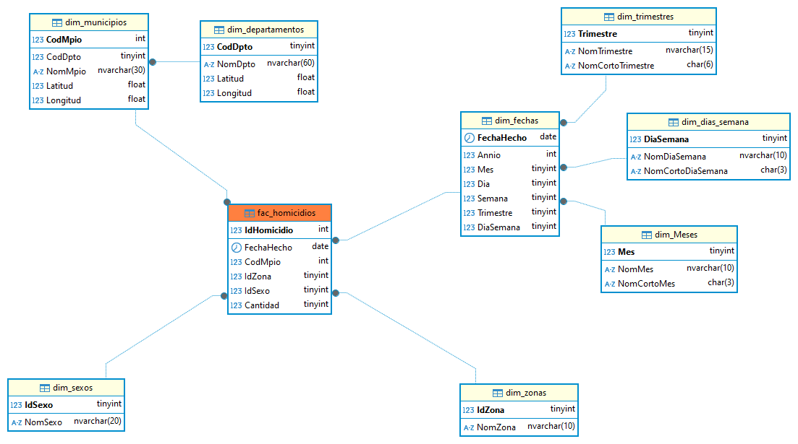

# DataWareHouse
Diseño y construcción de un almacén de datos orientado a la analítica, estructurado mediante un esquema en copo de nieve, inclute la definición e implementación de tablas de dimensiones y tablas de hechos optimizadas para consultas analíticas
## Relación Copo de Nieve.

